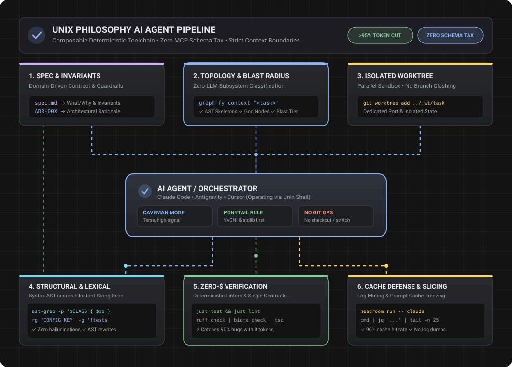
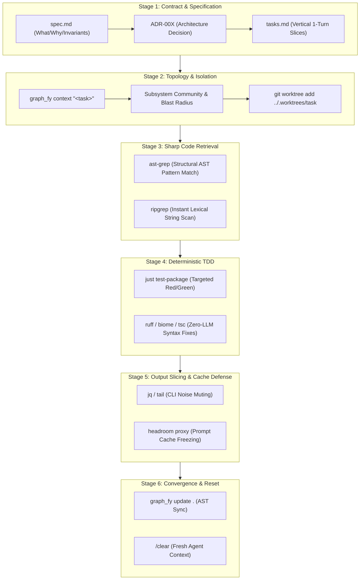

# Unix Agent Toolchain Flow: Composable, Deterministic, Zero-Schema-Tax Architecture

> *"Write programs that do one thing and do it well. Write programs to work together. Write programs to handle text streams, because that is a universal interface."*  
> — Doug McIlroy (The Unix Philosophy)



---

## 1. Executive Summary & Core Philosophy

Monolithic, "do-everything" AI coding agents face three structural bottlenecks in real-world enterprise engineering:
1. **The MCP Context Tax**: Injecting monolithic MCP schemas (80+ tools) consumes **4x to 32x more tokens** upfront before the model generates a single line of code.
2. **Context Rot**: Feeding entire source files or unfiltered terminal output causes catastrophic attention degradation past 40k–50k tokens.
3. **Hallucinated Tool Calls & Build Flags**: Expecting an LLM to guess compiler flags, build targets, or structural AST queries causes repetitive, expensive correction loops.

The **Unix Agent Toolchain** solves this by decomposing agentic software development into **small, sharp, deterministic utilities** piped together via the shell and filesystem. The AI agent acts strictly as an **orchestrator**, delegating heavy lifting to local, zero-token deterministic tools.

---

## 2. The 6-Stage End-to-End Pipeline



---

### Stage 1: Specification & Invariant Contracts (Zero Code Phase)
* **Goal**: Establish deterministic acceptance criteria before launching code generation.
* **Tools**: Markdown (`spec.md`), Architecture Decision Records (`docs/adr/ADR-00X.md`), Matt Pocock's `/grill-me` pattern.
* **Execution**:
  1. Author `spec.md` with explicit invariants (`INV-001`, `INV-002`) and Gherkin scenarios (`Given-When-Then`).
  2. If structural boundaries change, record an ADR documenting context, decision, and rejected alternatives.
  3. Decompose the feature into single-turn tasks in `tasks.md`.

---

### Stage 2: Codebase Topology & Filesystem Isolation
* **Goal**: Determine exact affected symbols and create an isolated sandbox for the agent.
* **Tools**: `graph_fy`, `git worktree`.
* **Execution**:
  ```bash
  # Step 2A: Query codebase topology (subsystems, god nodes, blast radius, Tier-1 skeletons)
  graph_fy context "implement invoice refund aggregate" > context_briefing.md

  # Step 2B: Create an isolated filesystem worktree (never contaminate main repo or switch branches)
  git worktree add ../.worktrees/feature-refund -b feature/invoice-refund
  cd ../.worktrees/feature-refund
  ```
* **Why Worktrees?**: Worktrees isolate files completely. Multiple agents can run simultaneously on different features without branch collisions or port conflicts.

---

### Stage 3: Structural & Lexical Code Retrieval (No Whole-File Dumps)
* **Goal**: Pinpoint exact symbol locations and AST patterns without reading 1,000-line source files.
* **Tools**: `ast-grep` (`sg`), `ripgrep` (`rg`).
* **Execution**:
  ```bash
  # Fast lexical search for string literals, route names, or env vars:
  rg "INVOICE_STATUS_PENDING" -g "!tests"

  # Structural AST search: Match exact functions, classes, or patterns:
  ast-grep -p 'class InvoiceAggregate { $$$METHODS }'

  # Safe structural rewrite across multiple files without model hallucinations:
  ast-grep --rewrite 'calculateTax($$$ARGS)' -r 'calculateTaxWithExemptions($$$ARGS, DEFAULT_POLICY)'
  ```
* **Unix Rule**: `ripgrep` finds *where* symbols live; `ast-grep` finds *how* syntax is structured. The agent reads only the matched snippets.

---

### Stage 4: Deterministic TDD & Zero-Dollar Verification
* **Goal**: Catch 90% of syntax errors, broken imports, and failed tests locally with zero LLM API cost.
* **Tools**: `just` (Command Contract), `ruff` / `biome` / `tsc --noEmit` / `spotless`.
* **Execution**:
  ```bash
  # Single source of truth command contract:
  just test tests/domain/test_invoice.py

  # Deterministic linter: Fixes formatting and syntax before agent self-corrects:
  just lint-fix
  ```
* **The `justfile` Contract**: Eliminates model guessing of build targets:
  ```just
  # justfile
  test:
      pytest -q --tb=short

  lint-fix:
      ruff check --fix . && ruff format .

  typecheck:
      mypy --config-file pyproject.toml .
  ```

---

### Stage 5: Output Slicing & Prompt Cache Defense
* **Goal**: Prevent terminal log spam from evicting prompt caches and causing context rot.
* **Tools**: `jq`, `tail`, `headroom` proxy.
* **Execution**:
  ```bash
  # Pipe large JSON/API outputs through jq to extract only relevant fields:
  curl -s http://localhost:8080/health | jq '{status: .status, dependencies: .deps}'

  # Mute compiler and test noise: Never dump 500 lines of tracebacks:
  just test | tail -n 25

  # Run agent behind headroom proxy to freeze prompt cache prefixes:
  headroom run -- claude
  ```
* **Token Impact**: Muting terminal logs preserves Anthropic 5-minute prompt cache blocks, dropping token costs by up to 90%.

---

### Stage 6: Incremental Knowledge Graph Sync & Context Reset
* **Goal**: Keep repository AST index current and eliminate agent context bloat.
* **Tools**: `graph_fy update .`, `/clear`.
* **Execution**:
  ```bash
  # 1. Incrementally refresh knowledge graph (AST-only, 0 API tokens)
  graph_fy update .

  # 2. Verify blast radius of touched symbols before submitting PR
  graph_fy diff origin/main

  # 3. Clear conversation context before starting the next atomic task
  /clear
  ```

---

## 3. Comparison Matrix: Monolithic vs. Unix AI Agent Stack

| Dimension | Monolithic Agent (All-in-One) | Unix Agent Stack (`graph_fy` + `sg` + `rg` + `wt` + `just`) |
| :--- | :--- | :--- |
| **Tool Interface** | Monolithic MCP Server (80+ tool schemas) | Sharp CLI binaries (`rg`, `sg`, `just`, `git`) + focused MCP |
| **Upfront Context Tax** | **4x to 32x token penalty** (injected schemas) | **Zero schema tax** (LLM uses standard bash commands) |
| **Code Retrieval** | Whole-file reads or naive chunk embeddings | `graph_fy` topology + `ast-grep` syntax queries |
| **Workspace Isolation** | In-place editing (clashing branches/state) | Ephemeral `git worktree` per task |
| **Error Feedback** | 500 lines of raw compiler output dumped in context | Piped output (`tail`, `jq`) + pre-flight deterministic linters |
| **Cache Retention** | Degrades quickly as context shifts | Preserved via `headroom` and `/clear` between tasks |
| **Token Cost ($)** | $5.00 – $25.00+ per medium feature | **$0.20 – $1.00 per medium feature** |

---

## 4. The Complete Developer Orchestration Script

Save this script as `scripts/agent-task.sh` to run isolated, token-efficient tasks:

```bash
#!/usr/bin/env bash
set -euo pipefail

TASK_NAME="${1:?Usage: $0 <task-name> \"<task-description>\"}"
TASK_DESC="${2:?Task description required}"
WT_DIR="../.worktrees/${TASK_NAME}"

echo "=== [1/5] Querying Codebase Topology via graph_fy ==="
graph_fy context "${TASK_DESC}" > /tmp/agent_context.md

echo "=== [2/5] Creating Isolated Git Worktree ==="
if [ ! -d "${WT_DIR}" ]; then
  git worktree add "${WT_DIR}" -b "feature/${TASK_NAME}"
fi
cp /tmp/agent_context.md "${WT_DIR}/CONTEXT_BRIEFING.md"

echo "=== [3/5] Launching Agent in Worktree with Headroom Proxy ==="
cd "${WT_DIR}"
headroom run -- claude "Read CONTEXT_BRIEFING.md and implement the task following TDD. Run 'just test' for verification."

echo "=== [4/5] Running Deterministic Linters & Verification ==="
just lint-fix
just test

echo "=== [5/5] Refreshing Knowledge Graph ==="
graph_fy update .
graph_fy diff origin/main

echo "=== Task ${TASK_NAME} Complete. Ready for human review. ==="
```
